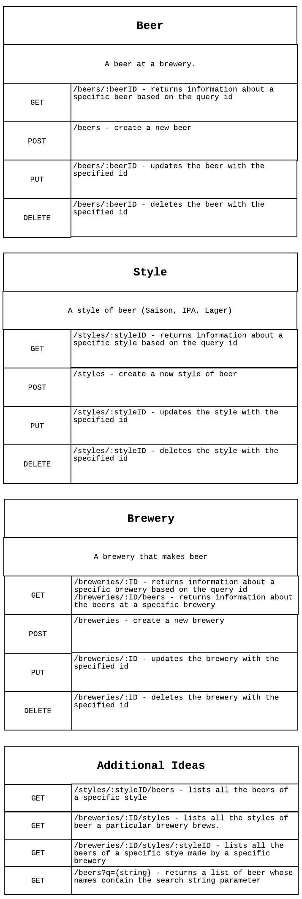

# Contents
1. [API Description](#description)
2. [Team Members](#members)
3. [Nouns](#Nouns)
4. [Verbs](#Verbs)
# I.P.A. API

This repository should run out of the box if your machine has Docker installed.

```docker-compose up```

Will spin up the database containers and the api container and effectively create a fully functioning API.

## API Description

This API will act as service for information related to beers and breweries. Specifically, what breweries are “currently” serving what beer, and what that beer is like. Beer data fields can be as broad as beer name and type or go as explicit as the IBU and alcohol content.

## Team Members

Daniel Schroeder <schrodan@oregonstate.edu>

## Nouns:

Beers, Breweries, Beer_Types (Lager, IPA, Hazy)

## Verbs:

GET, PUT, POST, DELETE


## API Endpoints



## Data Storage

This is a pre-mature mock up of what I expect my data to look like. (Subject to change).

```SQL
CREATE TABLE beer(
id INT NOT NULL AUTO_INCREMENT PRIMARY KEY,
beer_name VARCHAR(255) NOT NULL,
description TEXT,
in_stores BOOLEAN NOT NULL,
ibu INT NOT NULL,
CONSTRAINT ibu_check CHECK (ibu BETWEEN 1 AND 100),
abv DECIMAL(4,3) NOT NULL, /* we want alcohol percentage 0.001 - 0.99 */
created_at DATE NOT NULL,
FOREIGN KEY (brewery_id_fk) REFERENCES brewery(id),
FOREIGN KEY (style_id_fk) REFERENCES style(id)
);
```

```SQL
CREATE TABLE brewery(
id INT NOT NULL AUTO_INCREMENT PRIMARY KEY,
brewery_name VARCHAR(255) NOT NULL,
/*optional contact */
website VARCHAR(255),
facebook_url VARCHAR(255),
twitter_url VARCHAR(255),

/* location details */
address VARCHAR(255) NOT NULL,
city VARCHAR(255) NOT NULL,
state VARCHAR(255) NOT NULL,
);
```

```SQL
CREATE TABLE style(
id INT NOT NULL AUTO_INCREMENT PRIMARY KEY,
style_name VARCHAR(255) NOT NULL,
);
```

Schema Definitions for Request Body Validations
```JavaScript
const beerSchema = {
    beer_name: { required: true },
    description: { required: true },
    created_on: { required: true },
    Brewery: { required: true },
    Style: { required: true },
};
```
```JavaScript
const brewerySchema = {
    brewery_name: { required: true },
    website: { required: false },
    facebook_url: { required: false },
    twitter_url: { required: false },
    address: { required: true },
    city: { required: true },
    state: { required: true }
};
```
```JavaScript
const styleSchema = {
    style_name: { required: true }
};
```
## Security
- A description of the security mechanisms your API will implement.


